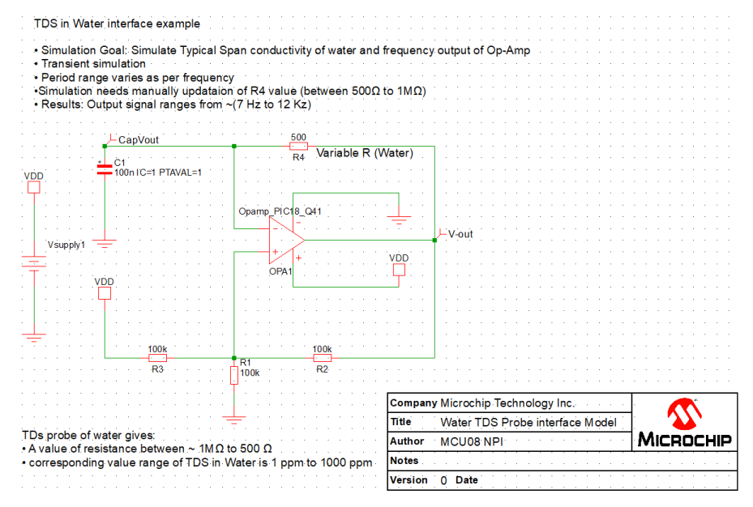

# Relaxation oscillator circuit using OPA of PIC16F17146 Mindi Simulation

**Note : Currently, this repository contains Mindi model of PIC18-Q41 family's OPAMP module. Mindi model of PIC16F17146 family's OPAMP module will be available soon.**

In this example, the OPA module of PIC16F17146 is used to form a relaxation oscillator. This Mindi simulation simulates the circuit described in the [TDS in water measurement Code Examples](https://github.com/microchip-pic-avr-examples/pic16f17146-water-tds-measurement-mplab-mcc). The simulation consists of a model of the PIC16F17146 OPA module and generic components representing the rest of the functionality of the circuit.
For more information about getting started with and using the MPLAB Mindi Analog Simulator please refer to the following resources:
- [Using the MPLAB Mindi Analog Simulator with the 8-Bit Operational Amplifier Module Technical Brief](https://www.microchip.com/DS90003293)
- [Microchip Developer - Introduction to MPLAB Mindi Analog Simulator](https://www.microchipdeveloper.com/mindi:mindi-analog-simulator-introduction)
- [Getting Started with the MPLAB Mindi Analog Simulator Document](https://www.microchip.com/DS50002564)

## Related Documentation

* [PIC16F17146 Product Page](https://www.microchip.com/en-us/product/PIC16F17146)
* [PIC16F17146 Data Sheet](https://www.microchip.com/DS40002343)
* [PIC16F17146 Curiosity Nano User Guide](https://www.microchip.com/DS50003037)

## Related Software
* [TDS in water measurement Code Examples](https://github.com/microchip-pic-avr-examples/pic16f17146-water-tds-measurement-mplab-mcc)

### Mindi Simulation

Download and open the **Mindi schematic [here](https://github.com/microchip-pic-avr-examples/pic16f17146-relaxation-oscillator-circuit-using-OPA-mindi/releases/tag/1.0.0)**

Press the _play_ button to simulate with an example stimulus source.

### Tweaking
User can tweak the value of R1 (which is variable in nature) representing the water conductivity. The given simulation example is having 10 points.

There is a specific parameters: 
* The frequency range can be changed by changing the value of Capacitor C1 (0.1 uF). 

### Don't have Mindi?
You can download and install the [Mindi simulation tool](https://www.microchip.com/mplab/mplab-mindi), or use another SPICE simulator of your own preference. For use with different simulators, a plain spice model can be found in "Opamp_PIC18_Q41.txt" to replace the mindi-optimized "Opamp_PIC18_Q41.lb "